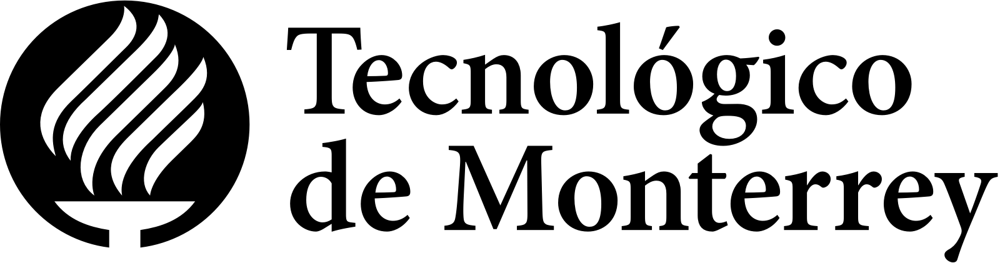
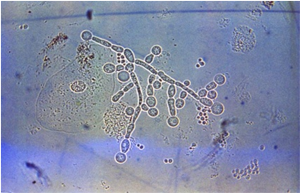
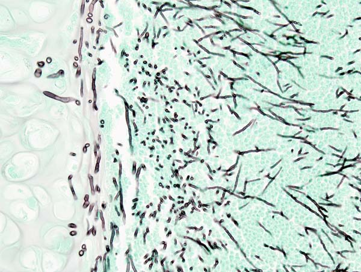
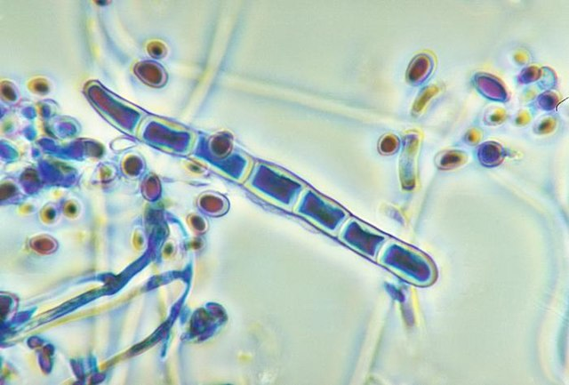
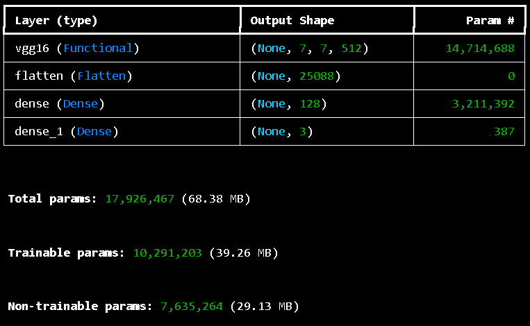
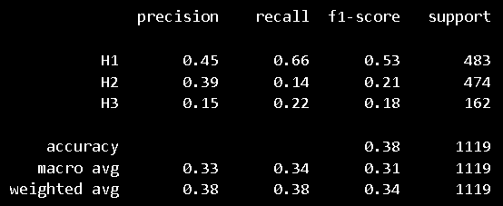
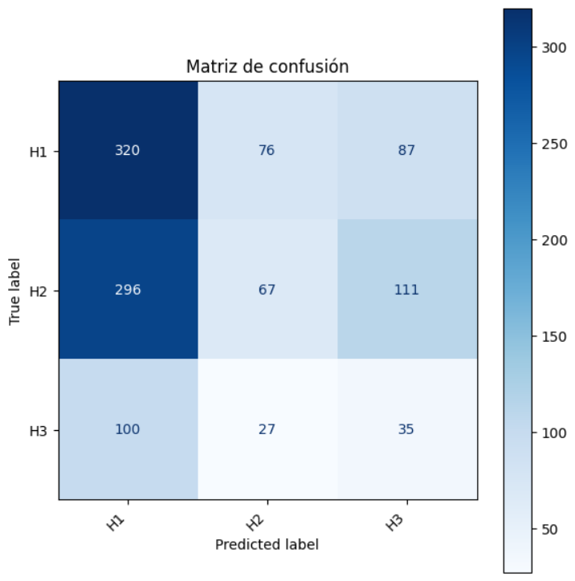
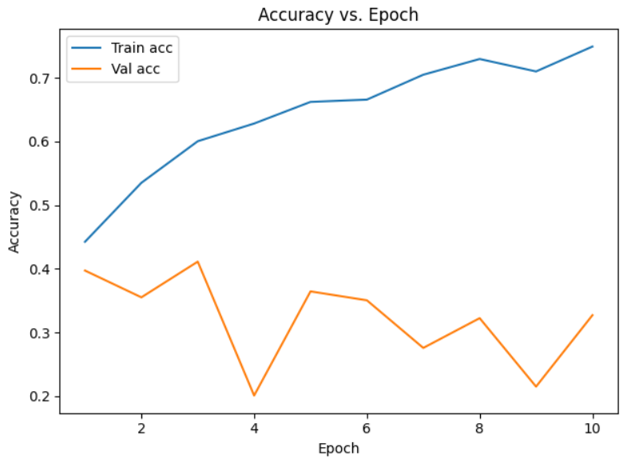
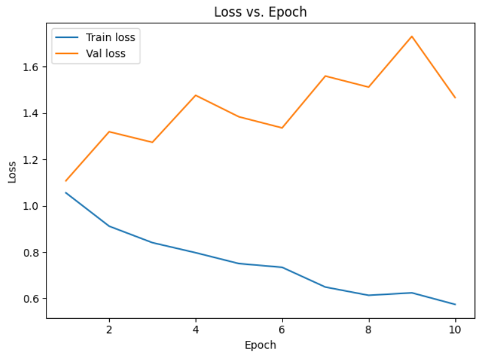

# Clasificación de Imágenes de Infecciones por Hongos con TensorFlow

<p align="right">
    
</p>

## 📝 Descripción

Proyecto académico para la materia Desarrollo de aplicaciones avanzadas de ciencias computacionales. Este repositorio implementa un modelo de aprendizaje supervisado con TensorFlow para la clasificación de imágenes médicas en cinco clases distintas de infecciones por hongos.
Se ha desarrollado con la técnica de **Aprendizaje Supervisado**. Esta es una subárea del Machine Learning en la que el modelo se entrena a identificar patrones alimentándose de un conjunto de datos con etiquetas (en este caso, utilizando 3 categorías). Se busca que el sistema realice una tarea de clasificación donde pueda identificar a cuál de las 3 categorías pertenece cada una de las imágenes

## Introducción

En la última década, la Inteligencia Artificial (IA) se ha desarrollado y establecido como herramienta fundamental en múltiples campos tanto científicos como tecnológicos. Particularmente, se ha avanzado sustancialmente en tareas de procesamiento de datos complejos, como el análisis de imágenes. Las redes neuronales artificiales, en especial las redes neuronales convolucionales (CNN, por sus siglas en inglés), han demostrado la capacidad para la extracción automática de características relevantes a partir de imágenes, facilitando la automatización de procesos anteriormente reservados a revisión manual por parte de ingenieros u otros profesionales.
De entre las aplicaciones más relevantes de las CNN, en este trabajo nos concentramos en la clasificación de imágenes como tarea crítica en uno de los muchos posibles contextos médicos y clínicos. Este tipo de redes es especialmente adecuado para identificar patrones visuales complejos, lo que las convierte en una herramienta poderosa en el diagnóstico por imagen. La estructura jerárquica que toman las CNN permite procesar la información visual desde niveles básicos como bordes y texturas, hasta representaciones de alto nivel entre ellas formas y estructuras celulares, permitiendo la identificación automatizada de patologías a partir de muestras visuales.
En el área de la microbiología médica, el uso de estas redes neuronales para la clasificación de imágenes ha probado ser eficaz en la detección de infecciones bacterianas y fúngicas. Estos modelos son entrenados con bases de datos (o datasets) de imágenes clínicas o de laboratorio y han logrado resultados confiables en la identificación de agentes patógenos en imágenes.
La incorporación de estas tecnologías en el diagnóstico clínico ha tenido un gran impacto en términos de eficiencia, accesibilidad y reducción de errores humanos. En particular, en entornos con recursos limitados o escasez de especialistas, los sistemas de clasificación automatizada pueden ser un apoyo valioso al personal médico, logrando diagnósticos más rápidos y acertados. Asimismo, estos modelos pueden ser integrados en plataformas digitales, facilitando la toma de decisiones clínicas en tiempo real. En el presente trabajo se enmarca en este contexto y tiene como objetivo desarrollar un modelo de red neuronal convolucional para la clasificación de imágenes de muestras clínicas, orientado a la detección de infecciones de origen fúngico. Este proyecto busca contribuir y entender el desarrollo de herramientas de apoyo para diagnóstico automatizado, promoviendo la adopción de tecnologías basadas en IA en entornos clínicos.

## State of the Art

Referencias del Estado del Arte (Papers):
J. Baral, A. K. Baral, S. K. Baral, D. K. Baral, and S. K. Baral, "Deep ensemble learning for bacterial colony classification," Frontiers in Microbiology, vol. 14, 2023, Art. no. 10173177. [Online]. Available: https://doi.org/10.3389/fmicb.2023.10173177

Y. Gao, X. Zhang, Y. Wang, and Z. Li, "Vision Transformer for fungal infection detection in time-lapse microscopy," Neural Networks, vol. 168, pp. 1–12, 2023. [Online]. Available: https://doi.org/10.1016/j.neunet.2023.07.219

Ha habido múltiples trabajos, proyectos e investigaciones que han apuntado su atención a este tema. En los precedentes de estos experimentos cuando iban empezando, los modelos se apoyaban en métodos de visión por computador basados en descriptores manuales como:

- SIFT (Scale-Invariant Feature Transform)
  Detecta y describe puntos clave en una imagen que son invariantes a escala, rotación e iluminación. Es útil para reconocer objetos o patrones en imágenes incluso si han sido rotados o escaladas.

- HOG (Histogram of Oriented Gradients)
  Divide la imagen en celdas pequeñas y computa histogramas de gradientes (direcciones de bordes). Fue muy usado en detección de peatones y estructuras anatómicas simples, ya que captura bien las formas y contornos locales.

- LBP (Local Binary Patterns)
  Analiza la textura local de una imagen comparando cada píxel con sus vecinos. Si un píxel vecino es mayor que el central, se asigna un 1, en caso contrario un 0. Estos patrones binarios se usan para describir texturas y estructuras microscópicas, como superficies celulares.

Sin embargo, la irrupción de las redes neuronales convolucionales (CNN) propició una transición hacia sistemas capaces de aprender representaciones jerárquicas directamente de los datos. Desde entonces, arquitecturas profundas como, por ejemplo, VGG, ResNet y DenseNet se han convertido en el estándar para tareas de diagnóstico por imagen como las que estamos trabajando en este proyecto. En el ámbito bacteriano, los estudios recientes evidencian mejoras sustanciales cuando se usan arquitecturas profundas.

## 📂 Sobre el Dataset

Recuperado del link: https://archive.ics.uci.edu/dataset/773/defungi
Autores: María Alejandra Vanegas Álvarez, Leticia Sopó, C. Sopo, F. Hajati, S. Gheisari

La estructura del dataset es la siguiente:

```
DFungi Dataset
├── test
│ ├── H1 (3563 imágenes)
│ ├── H2 (1887 imágenes)
│ └── H3 (667 imágenes)
└── train
│ ├── H1 (891 imágenes)
│ ├── H2 (474 imágenes)
│ └── H3 (162 imágenes)
└── augmented (312 imágenes)
```

Each of the sections represents the following fungi types:
H1: Candida albicans
Es un hongo que causa principalmente candidiasis, una infección que puede afectar diversas partes del cuerpo.

H2: Aspergillus niger
Es un hongo que, en altas concentraciones, puede producir aspergilosis invasiva que puede causar sangrado pulmonar grave y, a veces, mortal.

H3: Trichophyton rubrum
Es un hongo que causa dermatofitosis o tiñas, principalmente en la piel y las uñas, pero también puede afectar el pelo.

<p>
    
    
    
</p>

## 🔁 Data Augmentation

Para mejorar la generalización del modelo y evitar el sobreajuste debido al bias, la técnica de Data Augmentation. El proceso incluyó rotaciones de hasta 10 grados, desplazamientos horizontales de la imagen de hasta un 20%, zoom de hasta un 30% y volteo horizontal. Todo para permitir al modelo generar variantes de las imágenes alimentadas al inicio, enriqueciendo el dataset de entrenamiento sin necesidad de recolectar más datos.

```
# Usamos la función ImageDataGenerator de TensorFlow
train_datagen = ImageDataGenerator(
    rescale = 1./255, # Reescalamos las imágenes
    rotation_range = 10, # Las rotamos levemente (10 grados)
    width_shift_range = 0.2, # Permitimos que se ensanche la imagen
    zoom_range = 0.3, # Hacemos zoom
    horizontal_flip = True, #Volteamos la imagen
    validation_split=0.10
    )
```

Tras esto, guardamos las imágenes modificadas en la carpeta "augmented" como archivos .png. Esta función tiene un límite de crear 300 imágenes, debido a que sin ponerle límites, creaba más de 10,000 archivos. Esto alentaba el entrenamiento del modelo y, posteriormente, el guardado del mismo debido a la alta densidad de archivos.

```
temp_sampler_generator = train_datagen.flow_from_directory(
    "../DFungi_dataset/train",
    target_size=(224, 224),
    batch_size=saving_batch_size,
    class_mode='categorical',
    save_to_dir=sample_augmented_dir,
    save_prefix='aug',
    save_format='png',
    subset='training', # Use 'training' if validation_split is in train_datagen
    shuffle=False, # Keep shuffle=False for consistent sample generation
)
```

## 🧹 Preprocesamiento de Datos

Para preparar las imágenes antes de entrenar el modelo, se utilizó la clase ImageDataGenerator de TensorFlow con un reescalado de entre 0 y 1, dividiendo cada valor por 255. Esto con el propósito de permitir una mejor convergencia del modelo durante el entrenamiento. También, se hizo un redimensionamiento de las imágenes como el hecho en clase a un tamaño uniforme de 244x244 píxeles, según lo estipulado en la arquitectura VGG16 que se revisará más adelante, para asegurar la compatibilidad con la arquitectura de la red neuronal. Anteriormente, el modelo contaba con un recorte de las imágenes para hacer enfoque sólo de la zona de interés para el entrenamiento, algo que definitivamente apoyó bastante. Finalmente, se colocan los datos en batches y asigna etiquetas de clase en modo categórico debido a que esto es una clasificación multiclase (tenemos 3 clases) en vez de las usadas en clase que eran binarias (sólo 2 clasificaciones).

```
validation_generator = train_datagen.flow_from_directory(
    train_dir, # le damos el path de entrenamiento
    target_size = (224, 224), # Tamaño de las imágenes según VGG16
    # batch_size = 1 porque la RAM es un relajo XD
    subset='validation',
    batch_size = 1, # la cantidad de imágenes por conversión
    class_mode ='categorical', # modo categórico porque tenemos
    # 3 clases datos

test_generator = test_datagen.flow_from_directory(
    test_dir, # le damos el path de test
    target_size = (224, 224), # Tamaño de las imágenes según VGG16
    # batch_size = 1 porque la RAM es un relajo XD
    batch_size = 1, # la cantidad de imágenes por conversión
    class_mode ='categorical', # modo categórico porque tenemos
    # 3 clases datos
    )

train_generator = train_datagen.flow_from_directory(
    train_dir,# le damos el path de entrenamiento
    target_size = (224, 224), # Tamaño de las imágenes según VGG16
    batch_size = 8, # la cantidad de imágenes por conversión
    class_mode ='categorical', # modo categórico porque tenemos
    # 3 clases datos
    )
```

## VGG16 - Arquitectura del Modelo

Entre las arquitecturas más utilizadas, VGG16 destaca por su simplicidad estructural y su capacidad para lograr resultados competitivos en este tipo de tareas, debido a que consiste de empalmar capas sobre capas para lograr la arquitectura profunda que permite el aprendizaje supervisado eficiente. Fue una arquitectura introducida en 2014 por Simoyan y Zisserman. Se compone de 16 capas con pesos entrenables y utiliza filtros pequeños (3×3) con padding para conservar la dimensión espacial. Su diseño secuencial ha comprobado ser particularmente adecuado para problemas de detección de infecciones en imágenes microscópicas, debido a su capacidad para captar características finas en las imágenes como aquellas que usaremos para entrenar este modelo.
Las imágenes con las que trabajan los pesos de ImageNet es de 224\*224, por lo que tenemos un input de (224, 224, 3) como tensor (el 3 por los filtros previamente mencionados). VGG16 se desglosa de la siguiente manera:

- Capa de entrada:
  Dimensiones de entrada: (224, 224, 3)

- Capas convolucionales (64 filtros, filtros 3x3, mismo relleno):
  Dos capas convolucionales consecutivas con 64 filtros cada una y un tamaño de filtro de 3x3.
  Se aplica el mismo relleno para mantener las dimensiones espaciales.

- Capa de agrupación máxima (2x2, paso 2):
  Capa de agrupación máxima con un tamaño de grupo de 2x2 y un paso de 2.

- Capas convolucionales (128 filtros, filtros 3x3, mismo relleno):
  Dos capas convolucionales consecutivas con 128 filtros cada una y un tamaño de filtro de 3x3.

- Capa de agrupación máxima (2x2, paso 2):
  Capa de agrupación máxima con un tamaño de grupo de 2x2 y un paso de 2.

- Capas convolucionales (256 filtros, 3x3 filtros, mismo relleno):
  Dos capas convolucionales consecutivas con 256 filtros cada una y un tamaño de filtro de 3x3.

- Capas convolucionales (512 filtros, 3x3 filtros, mismo relleno):
  Dos conjuntos de tres capas convolucionales consecutivas con 512 filtros cada una y un tamaño de filtro de 3x3.

- Capa de agrupación máxima (2x2, paso 2):
  Capa de agrupación máxima con un tamaño de grupo de 2x2 y un paso de 2.

- Pila de capas convolucionales y agrupación máxima:
  Dos capas convolucionales adicionales a la pila anterior.
  Tamaño del filtro: 3x3.

- Aplanamiento:
  Aplanar el mapa de características de salida (7x7x512) en un vector de tamaño 25088.

- Capas completamente conectadas:
  Tres capas completamente conectadas con activación ReLU\*.

- Primera capa con tamaño de entrada 25088 y tamaño de salida 4096.

- Segunda capa con tamaño de entrada 4096 y tamaño de salida 4096.

- Tercera capa con tamaño de entrada 4096 y tamaño de salida 1000, correspondiente a las 1000 clases del desafío ILSVRC.
  Se aplica la activación Softmax al output de la tercera capa completamente conectada para la clasificación.

\*ReLU: es una función de activación que proporciona no linealidad al modelo para un mejor rendimiento de cálculo. Da como resultado el máximo entre su entrada y cero. Para entradas positivas, la salida de la función es igual a la entrada. Para salidas estrictamente negativas, la salida de la función es igual a cero.

```
from tensorflow.keras.applications import VGG16
from tensorflow.keras import layers, models

input_shape = (224, 224, 3)  # Tamaño de entrada de las imágenes según VGG16

# Load VGG16 with pre-trained ImageNet weights, excluding the top (classifier) layers
base_model = VGG16(weights='imagenet', include_top=False, input_shape=input_shape)

# Freeze base model layers so they are not trained
base_model.trainable = False

# Unfreeze some of the top layers
# For VGG16, 'block5_conv1' onwards are typically good candidates for unfreezing
# You can print base_model.summary() to see all layer names
for layer in base_model.layers:
    if layer.name.startswith('block5'): # Unfreeze layers in block5
        layer.trainable = True

model = models.Sequential()
model.add(base_model)
model.add(layers.Flatten())
model.add(layers.Dense(128, activation='relu'))  # Optional: add more dense layers
model.add(layers.Dense(3, activation='softmax'))

model.summary()

# Compilar el modelo
model.compile(loss='categorical_crossentropy', # Categorical Crossentropy for multi-class classification with one-hot labels
						optimizer=tf.keras.optimizers.Adam(learning_rate=0.0001),
						metrics=['accuracy']) # Accuracy to evaluate performance
```

De esta manera, la red queda como se muestra en la imagen:

<p>
    
</p>

Hubo una arquitectura previa en la cual se montaron las capas manualmente con so de MaxPooling2D después de cada capa convolutiva donde los filtros van escalando en valores de 2 elevado a las primeras potencias. Es un entrenamiento mucho más lento y lo máximo que se logró de accuracy fue de 61%. Está basado justamente en la arquitectura VGG16, pero justo con el planteamiento de que fuese más rápido de entrenar y procesar en su momento.

```
from tensorflow.keras import optimizers
from tensorflow.keras import models
from tensorflow.keras import layers

input_shape = (224,224,3)
model = models.Sequential()

model.add(layers.Conv2D(16, (3, 3), activation='relu', padding='same', input_shape=input_shape))
model.add(layers.Conv2D(16, (3, 3), activation='relu', padding='same'))
model.add(layers.MaxPooling2D((2, 2)))

model.add(layers.Conv2D(32, (3, 3), activation='relu'))
model.add(layers.Conv2D(32, (3, 3), activation='relu'))
model.add(layers.MaxPooling2D((2, 2)))

model.add(layers.Conv2D(64, (3, 3), activation='relu'))

model.add(layers.Flatten())

num_classes = 3
model.add(layers.Dense(num_classes, activation='softmax'))

model.summary()

model.compile(loss='categorical_crossentropy', # Categorical Crossentropy for multi-class classification with one-hot labels
            optimizer='adam',
            metrics=['accuracy']) # Accuracy to evaluate performance
```

Posteriormente, en la búsqueda de mejorar la precisión del modelo, se hizo la propuesta de añadir los pesos a los filtros. Una vez con esta decisión, se implementó la arquitectura VGG16 en su entereza con los pesos de ImageNet que son los pesos de default. Finalmente, tras la nueva implementación (que es la primera que podemos ver en esta sección) el accuracy del modelo en TRAINING subió a 75%. Eso quiere decir que, ante la solución de una arquitectura profunda, el modelo mejoró UN 14% en accuracy de TRAINING.

# Métricas y Resultados

Para evaluar el desempeño de una red neuronal convolucional (CNN) en tareas de clasificación o en cualquier caso, requiere el uso de métricas particulares. ¿Cómo se puede mejorar si no se sabe con exactitud el estado actual del proyecto? Esto es especialmente relevante en contextos donde los datos pueden estar desbalanceados, o cuando los errores tienen implicaciones importantes. Las métricas que se utilizaron para analizar el rendimiento de este modelos son los siguientes:

- Precisión:
  Indica qué proporción de las predicciones positivas realizadas por el modelo son realmente correctas. Es útil cuando se desea minimizar los falsos positivos, por ejemplo, evitando diagnosticar erróneamente una infección cuando no es correcta. Si el modelo identifica una imagen como perteneciente a una clase, ¿cuántas veces acertó?

- Sensibilidad o "recall":
  Mide la capacidad del modelo para identificar correctamente todos los casos positivos reales. Esta métrica es clave en contextos médicos, donde pasar por alto un caso positivo (falso negativo) puede ser clínicamente riesgoso. Se resume a la pregunta, de todas las imágenes que realmente muestran infección, ¿cuántas detectó el modelo?

- F1:
  Combina los resultados tanto la precisión como la sensibilidad en una sola métrica. Es especialmente útil cuando existe un desbalance entre clases o cuando se necesita un equilibrio entre los falsos positivos y los falsos negativos.

- Soporte:
  Representa el número total de muestras reales que pertenecen a cada clase. Aunque no es una métrica de rendimiento por sí misma, proporciona contexto sobre la confiabilidad de las métricas anteriores, ya que los valores calculados sobre clases con muy pocos ejemplos pueden ser inestables o poco representativos.

Estas métricas suelen presentarse de forma desglosada por clase en tablas de reporte, lo que permite un análisis detallado del comportamiento del modelo. En el caso de este modelo, se utilizaron las métricas mencionadas anteriormente al igual que una matriz de confusión. Como lo menciona su nombre, representa gráficamente qué tanto se "confundió" y acertó el modelo, comparando el resultado esperado con el que predijo el modelo.

<p>
    
</p>

Como se puede ver en la tabla de arriba, el modelo tiene un desempeño general bajo. ¿Pero qué no se había mencionado antes que se tenía un accuracy de 75%? ¿Qué pasó? El valor de 75% sale de los archivos seleccionados para entrenar el modelo. Eso quiere decir que son archivos que el mismo modelo reconoce y puede identificar con mayor facilidad. Sin embargo, las pruebas para las métricas usan los archivos del dataset en la carpeta de TEST. Imágenes que el modelo nunca ha visto y batalla más en reconocer. El accuracy final de la prueba con TEST fue de 0.38, lo que implica que menos del 40 % de las predicciones fueron correctas en relación al total de muestras. Esta cifra está por debajo del umbral de utilidad práctica para la mayoría de las aplicaciones.

En desglose:
La clase H1 obtuvo el mejor rendimiento relativo, con una precisión de 0.45 y una sensibilidad (recall) de 0.66. Esto quiere decir que el modelo identifica correctamente la mayoría de los casos reales de H1, aunque también comete un número considerable de falsos positivos.

La clase H2 mostró un desempeño bajo, especialmente en recall (0.14), lo cual sugiere que el modelo está fallando en reconocer la mayoría de los casos de esta clase. Su precisión es ligeramente mejor (0.39), lo que indica que cuando predice H2, no lo hace con demasiada frecuencia, pero sí con algo más de acierto.

La clase H3 fue la más débilmente clasificada, con precisión, recall y F1-score todos por debajo de 0.25. Esto es un fuerte indicio de que el modelo apenas está reconociendo los casos de esta clase y, cuando lo hace, no es confiable.

Todo esto se puede observar a través de la matriz de confusión más abajo:

<p>
    
</p>

Finalmente, los promedios macro y ponderado (macro avg y weighted avg) muestran consistencia con los datos por clase, revelando un rendimiento bajo y un desequilibrio entre clases. El F1-score ponderado de 0.34 indica que incluso teniendo en cuenta el número de muestras por clase, el modelo no logra un rendimiento satisfactorio.
Los resultados obtenidos muestran que el modelo aún presenta deficiencias en su capacidad de clasificación, especialmente en lo que respecta a las clases H2 y H3. Aunque la clase H1 presenta métricas más aceptables, el bajo desempeño en las otras dos clases afecta negativamente el resultado global. ¿Si tiene falsos positivos de H1 para la gran mayoría de las imágenes, qué tanto podríamos confiar en él? Además, la baja accuracy (38 %) y los bajos valores de las demás métricas sugieren que el modelo no generaliza bien y tiene dificultades para distinguir entre patrones de las distintas clases.

También, se hicieron las gráficas respecto a las comparaciones del TRAINING y VALIDATION en tanto el accuracy como el loss del modelo.

<p>
    
</p>
<p>
    
</p>

El modelo muestra señales claras de OVERFITTING. Si seguimos ambas líneas en las gráficas, podemos observar que las líneas no tienen muchas curvas. También, la precisión y pérdida en validación fluctúa mucho y permanece baja durante todas las épocas. Y la diferencia que existe entre el TRAINING y el VALIDATION demuestra que el training va muchísimo mejor, además de que las propias métricas nos presentan el problema de que el modelo aprende patrones específicos del conjunto de entrenamiento y no se generaliza bien a datos nuevos como los que se encuentran el TEST. En resumen, que el modelo está memorizando en vez de aprender a identificar las imágenes.
